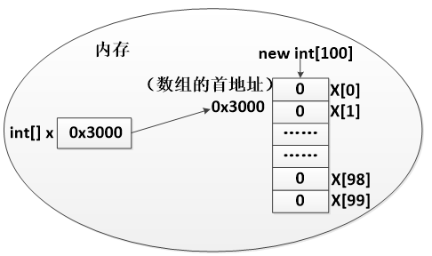

# 1 回顾

```java
public static void main(String[] args){

}
```

+ 1、有参数有返回值
+ 2、有参数无返回值
+ 3、无参数有返回值
+ 4、无参数无返回值
+ 哪种方法类型最有用？有参数的方法功能更加丰富，有返回值的方法得到的结果更加灵活。

## 1.1 快捷键

+ 选中希望成为方法体内容的语句---->右键---->Refactor----->Extract Method

## 1.2 方法重载

+ 同一个方法名，承载了多重功能
+ 根据参数列表的不同，来调用不同功能的方法
+ 参数列表的不同的体现：参数个数、参数类型不同

```java
public class HelloWorld {
	public static void main(String[] args) {
		add(1,2);
		add(1.5 , 1.3);
		add(1.5 , 1.3 , 2.8);
	}

	public static void add(int a, int b) {
		System.out.println(a+b);
	}
	// 参数个数相同，调整了参数类型
	public static void add(double a, double b) {
		System.out.println(a+b);
	}
	// 调整了参数个数
	public static void add(double a, double b, double c) {
		System.out.println(a+b+c);
	}
}
```

# 2 数组

+ 其实也是个容器
+ 相比基本数据类型声明的变量，数组能够存储多个数据元素
+ 数组中存储的元素数据类型必须一致
+ 数组定义好之后，数组长度不再发生变化

## 2.1 定义数组

+ 动态初始化：不知道数组将要存储的内容
+ 静态初始化：知道数组将要存储的内容

```java
public class HelloWorld {
	public static void main(String[] args) {
		// 动态初始化:不知道数组将要存储的内容
		int[] x = new int[100];
		// 静态初始化：知道数组将要存储的内容
		int[] y = {1,2,3,4};
		int[] z = new int[]{1,2,3,4};
	}
}
```



```java
public class HelloWorld {
	public static void main(String[] args) {
		// 引用数据类型
		// 定义数组
		int[] x;                 // 声明数组
		x = new int[100];        // 初始化数组
		System.out.println(x);   // [I@15db9742
	}
}
```

## 2.2 访问数组元素

+ 下标、索引（index）
+ 数组中的所以：起始值为0，终止值为“数组长度-1”
+ 获取数组的长度：数组名.length，来获取数组长度

```java
public class HelloWorld {
	public static void main(String[] args) {
        // 动态初始化
		int[] x = new int[100];
		System.out.println(x[0]); // 0
        // 静态初始化
		int[] x = {1,2,3,4};
		System.out.println(x[0]);         // 1
		System.out.println(x[3]);         // 4
		System.out.println(x[x.length-1]);// 4
	}
}
```

+ 长度：数组中元素的个数

```java
public class HelloWorld {
	public static void main(String[] args) {
		// 获取数组的长度
		int[] x = {1,2,3,4};
		System.out.println(x.length);       // 4
		// 获取字符串的长度
		String str1 = "nihao";
		System.out.println(str1.length());  // 5
	}
}
```

| **数据类型**           | **默认初始化值**             |
| ---------------------- | ---------------------------- |
| byte、short、int、long | 0                            |
| float、double          | 0.0                          |
| char                   | 一个空字符，即’\u0000’       |
| boolean                | false                        |
| 引用数据类型           | null，表示变量不引用任何对象 |

## 2.3 异常

+ 数组索引越界异常

```java
public class HelloWorld {
	public static void main(String[] args) {
		// ArrayIndexOutOfBoundsException
		int[] x = new int[100];
		System.out.println(x[100]); 
	}
}
```

+ 空指针异常

```java
public class HelloWorld {
	public static void main(String[] args) {
		// NullPointerException
		int[] y = null;
		System.out.println(y[0]);
	}
}
```

# 3 数组常见操作

## 3.1 遍历循环

+ 下标遍历循环
+ 缺点：格式相对复杂，敲得时候容易出错

```java
public class HelloWorld {
	public static void main(String[] args) {
		int[] x = {1,2,3,4};
		// i:0-（长度-1）
		for (int i = 0; i < x.length; i++) {
			System.out.println(x[i]);
		}
	}
}
```

+ for each遍历
+ 缺点：1、不能遍历数组中某一范围的元素。2、不能使用到下标这样有用数据了。

```java
public class HelloWorld {
	public static void main(String[] args) {
		int[] x = {1,2,3,4};
		for (int i : x) {
			System.out.println(i);
		}
	}
}
```

## 3.2 查找元素

+ 线性查找

```java
public class HelloWorld {
	public static void main(String[] args) {
		// 查找x数组中4对应元素的下标
		int[] x = {1,4,3,4};
		
		// 从左边查，第1个匹配的元素的下标
		for (int i = 0; i < x.length; i++) {
			if (x[i] == 4){
				System.out.println(i);
				break;
			}
		}
		// 从左边查，所有匹配的元素的下标
		for (int i = 0; i < x.length; i++) {
			if (x[i] == 4){
				System.out.println(i);
			}
		}
		// 从右边查，第1个匹配的元素的下标
		for (int i = x.length-1; i >= 0; i--) {
			if (x[i] == 4){
				System.out.println(i);
				break;
			}
		}
	}
}
```

+ 抽取为方法

```java
public class HelloWorld {
	public static void main(String[] args) {
		// 查找x数组中4对应元素的下标
		int[] x = {1,4,3,4};
		
		// 从左边查，第1个匹配的元素的下标
		find(x,3);
		// 从左边查，所有匹配的元素的下标
		findAll(x,4);
		// 从右边查，第1个匹配的元素的下标
		rFind(x,4);
	}

	public static void rFind(int[] x,int n) {
		for (int i = x.length-1; i >= 0; i--) {
			if (x[i] == n){
				System.out.println(i);
				break;
			}
		}
	}

	public static void findAll(int[] x, int n) {
		for (int i = 0; i < x.length; i++) {
			if (x[i] == n){
				System.out.println(i);
			}
		}
	}

	public static void find(int[] x, int n) {
		for (int i = 0; i < x.length; i++) {
			if (x[i] == n){
				System.out.println(i);
				break;
			}
		}
	}
}
```

