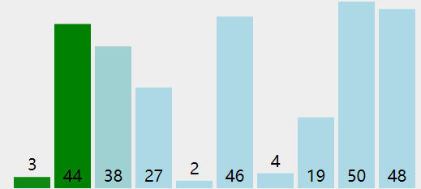
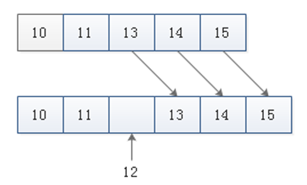

# 1 数组常见操作

## 1.1 遍历循环

- 下标遍历循环
- 缺点：格式相对复杂，敲得时候容易出错

```java
public class HelloWorld {
	public static void main(String[] args) {
		int[] x = {1,2,3,4};
		// i:0-（长度-1）
		for (int i = 0; i < x.length; i++) {
			System.out.println(x[i]);
		}
	}
}
```

- for each遍历
- 缺点：1、不能遍历数组中某一范围的元素。2、不能使用到下标这样有用数据了。

```java
public class HelloWorld {
	public static void main(String[] args) {
		int[] x = {1,2,3,4};
		for (int i : x) {
			System.out.println(i);
		}
	}
}
```

## 1.2 查找元素

- 线性查找（工作量大）

```java
public class HelloWorld {
	public static void main(String[] args) {
		// 查找x数组中4对应元素的下标
		int[] x = {1,4,3,4};
		
		// 从左边查，第1个匹配的元素的下标
		for (int i = 0; i < x.length; i++) {
			if (x[i] == 4){
				System.out.println(i);
				break;
			}
		}
		// 从左边查，所有匹配的元素的下标
		for (int i = 0; i < x.length; i++) {
			if (x[i] == 4){
				System.out.println(i);
			}
		}
		// 从右边查，第1个匹配的元素的下标
		for (int i = x.length-1; i >= 0; i--) {
			if (x[i] == 4){
				System.out.println(i);
				break;
			}
		}
	}
}
```

- 抽取为方法

```java
public class HelloWorld {
	public static void main(String[] args) {
		// 查找x数组中4对应元素的下标
		int[] x = {1,4,3,4};
		
		// 从左边查，第1个匹配的元素的下标
		find(x,3);
		// 从左边查，所有匹配的元素的下标
		findAll(x,4);
		// 从右边查，第1个匹配的元素的下标
		rFind(x,4);
	}

	public static void rFind(int[] x,int n) {
		for (int i = x.length-1; i >= 0; i--) {
			if (x[i] == n){
				System.out.println(i);
				break;
			}
		}
	}

	public static void findAll(int[] x, int n) {
		for (int i = 0; i < x.length; i++) {
			if (x[i] == n){
				System.out.println(i);
			}
		}
	}

	public static void find(int[] x, int n) {
		for (int i = 0; i < x.length; i++) {
			if (x[i] == n){
				System.out.println(i);
				break;
			}
		}
	}
}
```

+ 二分法查找（效率较高，前提：数组要排好序）

## 1.3 数组排序

+ 冒泡排序

### 1.3.1 原理



+ 原数组：4321
+ 第1轮比较：3421    3241    3214            比较了3次
+ 第2轮比较：2314    2134                         比较了2次
+ 第3轮比较：1234                                      比较了1次   

```java
public class HelloWorld {
	public static void main(String[] args) {
		int[] x = {1,3,2,4};
		// 控制比较多少轮        i: 0  1  2
		for (int i = 0; i < x.length-1; i++) {
			// 每轮比较几次       j: 
			for (int j = 0; j < x.length - i - 1; j++) {
				if (x[j] < x[j+1]){       
					int temp = x[j];
					x[j] = x[j+1];
					x[j+1] = temp;
				}
			}
		}
		for (int i : x) {
			System.out.println(i);
		}
	}
}
```

## 1.4 插入元素

+ {15,11,13,14}
+ 将12插入到升好序的相应位置



```java
public class HelloWorld {
	public static void main(String[] args) {
		//- {15,11,13,14}
		//- 将12插入到升好序的相应位置  {11,12,13,14,15}
		
		// 1、创建一个新的数组，其长度为原数组长度+1
		int insNum = 12; 
		int[] arr = {15,11,13,14};
		int[] arrNew = new int[arr.length + 1];
		// 2、排序{11,13,14,15}
		paiXu(arr);
		// 3、查找应该被插入的位置索引
		int index = 0;
		for (int i = 0; i < arr.length; i++) {
			if (arr[i] > insNum){
				index = i;
				break;
			}
		}
		// 4、将12插入到数组中
		for (int i = 0; i < arrNew.length; i++) {
			if (i < index){
				arrNew[i] = arr[i];
			}else if (i == index){
				arrNew[i] = insNum;
			}else if (i > index){
				arrNew[i] = arr[i-1];
			}
		}
		// 5、遍历新数组
		for (int i : arrNew) {
			System.out.println(i);
		}
	}

	public static void paiXu(int[] x) {
		for (int i = 0; i < x.length-1; i++) {
			// 每轮比较几次       j: 
			for (int j = 0; j < x.length - i - 1; j++) {
				if (x[j] > x[j+1]){       
					int temp = x[j];
					x[j] = x[j+1];
					x[j+1] = temp;
				}
			}
		}
	}
}
```

+ 抽取为方法

```java
public class HelloWorld {
	public static void main(String[] args) {
		//- {15,11,13,14}
		//- 将12插入到升好序的相应位置  {11,12,13,14,15}
		
		// 1、创建一个新的数组，其长度为原数组长度+1
		int insNum = 10; 
		int[] arr = {1,9,11,8,7,6};
		// 2、排序{11,13,14,15}
		paiXu(arr);
		// 3、查找应该被插入的位置索引
		int[] arrNew = insert(insNum, arr);
		// 5、遍历新数组
		for (int i : arrNew) {
			System.out.println(i);
		}
	}
	
	// 插入数组
	public static int[] insert(int insNum, int[] arr) {
		int index = search(insNum, arr);
		// 4、将12插入到数组中
		int[] arrNew = new int[arr.length + 1];
		for (int i = 0; i < arrNew.length; i++) {
			if (i < index){
				arrNew[i] = arr[i];
			}else if (i == index){
				arrNew[i] = insNum;
			}else if (i > index){
				arrNew[i] = arr[i-1];
			}
		}
		return arrNew;
	}

	public static int search(int insNum, int[] arr) {
		int index = 0;
		for (int i = 0; i < arr.length; i++) {
			if (arr[i] > insNum){
				index = i;
				break;
			}
		}
		return index;
	}

	public static void paiXu(int[] x) {
		for (int i = 0; i < x.length-1; i++) {
			// 每轮比较几次       j: 
			for (int j = 0; j < x.length - i - 1; j++) {
				if (x[j] > x[j+1]){       
					int temp = x[j];
					x[j] = x[j+1];
					x[j+1] = temp;
				}
			}
		}
	}
}
```

# 2 Arrays类

```java
import java.util.Arrays;

public class HelloWorld {
	public static void main(String[] args) {
		int[] x = {4,2,3,1};
		// 查找元素
		System.out.println(Arrays.binarySearch(x, 3));
		// 复制数组
		int[] y = Arrays.copyOf(x, 3);
		for (int i : y) {
			System.out.println(i);
		}
		// 排序
		Arrays.sort(x);
		for (int i : x) {
			System.out.println(i);
		}
		// 遍历输出
		System.out.println(Arrays.toString(x));
	}
}
```

# 3 二维数组

+ 矩阵

## 3.1 定义二维数组

```java
public class HelloWorld {
	public static void main(String[] args) {
		// 动态初始化
		int[][] x = new int[3][4];
		int[][] y = new int[3][];
		// 静态初始化
		int[][] z = {
				{1,2},
				{3,4,5}};
	}
}
```

## 3.2 访问二维数组元素

```java
public class HelloWorld {
	public static void main(String[] args) {
		int[][] x = {
				{1,2},
				{3,4,5}};
		System.out.println(x[0][1]);// 2
		System.out.println(x.length);// 2
		System.out.println(x[0].length);// 2
		System.out.println(x[1].length);// 3
	}
}
```

## 3.3 练习

### 3.3.1 求数组所有元素的和

```java
public class HelloWorld {
	public static void main(String[] args) {
		int[][] x = {
				{1,2},
				{3,4,5}};
		int sum = 0;
		for (int i = 0; i < x.length; i++) {
			for (int j = 0; j < x[i].length; j++) {
				sum += x[i][j];
			}
		}
		System.out.println(sum);
	}
}
```

### 3.3.2 公司销售额之和

```java
public class HelloWorld {
	public static void main(String[] args) {
		int[][] x = {
				{1,2},
				{3,4,5}};
		int sum = 0;
		for (int i = 0; i < x.length; i++) {
			int groupSum = 0;
			for (int j = 0; j < x[i].length; j++) {
				groupSum += x[i][j];
			}
			System.out.printf("每一个小组的和：%d\n",groupSum);
			sum += groupSum;
		}
		System.out.println(sum);
	}
}
```

```java
public static void main(String[] args) {
    // 定义一个长度为3的二维数组
	int[][] arr = new int[3][];  
    // 为数组的元素赋值
	arr[0] = new int[] { 11, 12 };      	 
	arr[1] = new int[] { 21, 22, 23 };
	arr[2] = new int[] { 31, 32, 33, 34 };
    // 定义变量记录总销售额
	int sum = 0;            
    // 遍历数组元素
	for (int i = 0; i < arr.length; i++) {       
        // 定义变量记录小组销售总额
	    int groupSum = 0;          
        // 遍历小组内每个人的销售额
	    for (int j = 0; j < arr[i].length; j++) {
			groupSum = groupSum + arr[i][j];
	    }
        // 累加小组销售额
	    sum = sum + groupSum;	
	    System.out.println("第" + (i + 1) + "小组销售额为：" + groupSum + " 万元。");
	}
 	System.out.println("总销售额为: " + sum + " 万元。");
}
```

