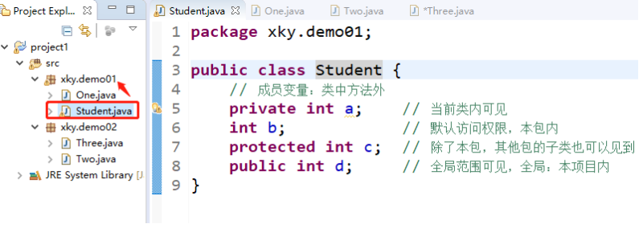
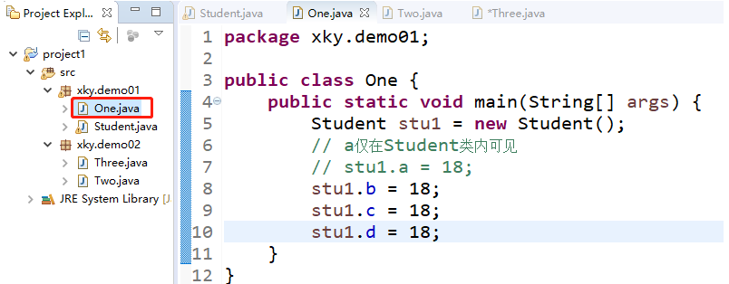
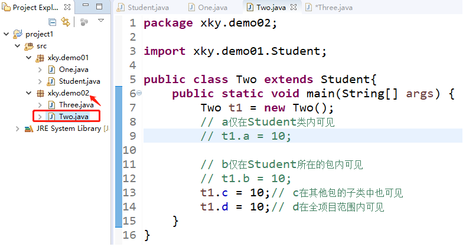
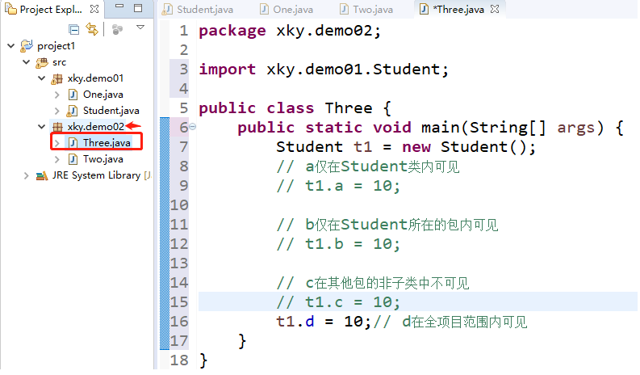

# 1 回顾

+ 数组的定义
+ 访问数组中的元素
+ 常见操作（遍历数组、查找元素、数组排序、插入元素、复制数组、判断数组相等）
+ Arrays类
+ 二维数组

# 2 面向对象

## 2.1 编程思想

+ 面向过程（圆面积计算）
+ 面向对象（挖坑种树）

## 2.2 三大特性

+ 封装性（插线板）
+ 继承性（子承父业）（子类继承父类所有的属性和方法）
+ 多态性（水的多态）（调用父类的方法的时候，会有不同的功能体现）

## 2.3 为什么要学习面向对象

+ 一切皆对象
+ 提高编程效率
+ 自己造铁锹（当Java不具备某个功能时）

# 2 类与对象

+ 类：某一类群体的抽象（人类、猫、狗）（类具备这一类群体共有的一般特征和行为）
+ 对象：类中一个个具体的事物（小明、张三、李四）

## 2.1 类的定义

```java
修饰符 class 类名{
	// 成员变量（表示类中群体共有一般特征）
	// 成员方法（表示类中群体共有的行为）
} 
```

+ 类名：首字母大写
+ 类：是引用数据类型

### 2.1.1 成员变量

+ 表示类中群体共有一般特征（类中方法外）

### 2.2.2 成员方法

+ 表示类中群体共有的行为

### 2.1.3 学生类

```java
public class Student {
	// 成员变量
	String name;
	String sex;
	int age;
	// 成员方法
	void study(){
		System.out.println(name + "正在学习");
	}
	void play(){
		System.out.println(name + "正在娱乐");
	}
}
```

## 2.2 对象的创建和使用

### 2.2.1 创建对象

### 2.2.2 访问成员变量

### 2.2.3 调用成员方法

+ 对象名.成员方法

```java
public class Test {
	public static void main(String[] args) {
		Student zhangsan = new Student();
		// 调用成员变量
		zhangsan.name = "张三";
		// 调用成员方法
		zhangsan.study();
		zhangsan.play();
		
		
		// 创建第二个对象
		Student stu2 = new Student();
		stu2.name = "李四";
		stu2.study();
	}
}
```

## 2.3 对象引用传递

+ 对象名

```java
public class Test {
	public static void main(String[] args) {
		Student zhangsan = new Student();
		System.out.println(zhangsan);
	}
}
// xky.demo01.Student@15db9742
```

+ 对象引用传递

```java
public class Test {
	public static void main(String[] args) {
		Student zhangsan = new Student();
		zhangsan.name = "张三";
		
		Student lisi = zhangsan;
		lisi.study();          // 张三正在学习
		lisi.name = "张二";
		lisi.study();          // 张二正在学习
	}
}
```

## 2.4 访问控制

+ public、protected、default、private
+ public和private用的最多
+ 作用：用来修饰成员变量、成员方法。以此来控制他们的可见范围

| **访问范围** | **private** | **default** | **protected** | **public** |
| ------------ | ----------- | ----------- | ------------- | ---------- |
| 同一类中     | √           | √           | √             | √          |
| 同一包中的类 |             | √           | √             | √          |
| 不同包的子类 |             |             | √             | √          |
| 全局范围     |             |             |               | √          |







