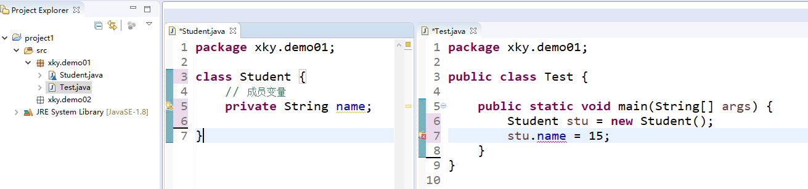
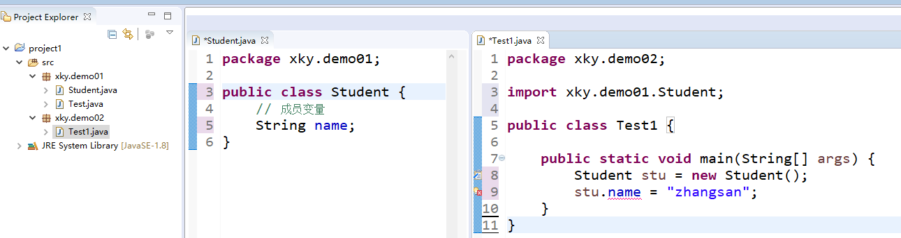
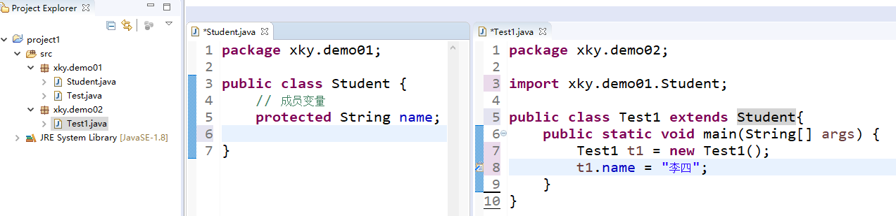

# 1 回顾

+ 类的定义（成员变量、成员方法）
+ 对象的创建和使用。对象的创建：类名 对象名 = new 类名（）；访问成员变量：对象名.成员变量。调用成员方法：对象名.成员方法

+ 对象的引用传递

# 2 访问控制权限

+ 可见修饰符：private、default、protected、public
+ 使用最多的：private、public

## 2.1 作用

+ 作用：用来修饰成员变量、成员方法

| **访问范围** | **private** | **default** | **protected** | **public** |
| ------------ | ----------- | ----------- | ------------- | ---------- |
| 同一类中     | √           | √           | √             | √          |
| 同一包中的类 |             | √           | √             | √          |
| 不同包的子类 |             |             | √             | √          |
| 全局范围     |             |             |               | √          |

+ private：只能在本类中可见



+ default（不用可见修饰符修饰的话，就是默认权限）：只能在本包中可见



+ protected：除了本包内可见，其他包的子类也可见



+ public：全项目范围内可见

## 2.2 思考题

+ 跨项目如何可见

## 2.3 注意事项

+ 可见修饰符中，只有public、default能够修饰类

# 3 封装性

## 3.1 为什么要封装

+ 封装是指一种将类的实现细节包装、隐藏起来的方法。封装可以被认为是一个保护屏障，防止本类的代码和数据被外部类定义的代码随机访问。

### 3.1.1 类的定义 

``` java
public class Student {
	// 成员变量
	String name;
	int age;
	
	// 成员方法
	public void introduceSelf(){
		System.out.println("我是："+name+"，我"+age+"岁啦");
	}
}
```

### 3.1.2 对象的创建和使用

```java
public class Test {
	public static void main(String[] args) {
		Student stu = new Student();
		// 调用成员变量
		stu.name = "张三";
		stu.age = -18;

		// 调用成员方法
		stu.introduceSelf();
	}
}
// 我是：张三，我-18岁啦
```

+ 如上代码所示，不封装是不合理的。
+ 所以，为了避免这种错误的发生，在设计Student类时，应该对成员变量的访问作出一些限定，不允许外界随意访问，这就需要实现类的封装。

## 3.2 如何完成封装

+ 使用private修饰类中所有的成员变量

### 3.2.1 类的定义

```java
public class Student {
	// 成员变量
	private String name;
	private int age;
	
	// 成员方法
	public void introduceSelf(){
		System.out.println("我是："+name+"，我"+age+"岁啦");
	}
	public void setName(String i){
		name = i;
	}
	public String getName(){
		return name;
	}
	public void setAge(int i){
		if (i < 0 || i > 150){
			System.out.println("年龄有误");
		}else{
			age = i;			
		}
	}
	public int getAge(){
		return age;
	}
}
```

### 3.2.2 对象的创建和使用

```java
public class Test {
	public static void main(String[] args) {
		Student stu = new Student();
		// stu.name = "张三";
		// stu.age = 200;
		stu.setName("张三");
		stu.setAge(-18);
		stu.introduceSelf();
	}
}
// 年龄有误
// 我是：张三，我0岁啦
```

## 3.3 设置getters和setters的快捷键

+ 快捷键：shift + alt + s
+ generate getters and setters

```java
public class Student {
	// 成员变量
	private String name;
	private int age;
	
	// 成员方法
	public void introduceSelf(){
		System.out.println("我是："+name+"，我"+age+"岁啦");
	}
	public String getName() {return name;}
	public void setName(String name) {this.name = name;}
	public int getAge() {return age;}
	public void setAge(int age) {
		if (age < 0 || age > 150){
			System.out.println("年龄有误");
		}else{
			this.age = age;			
		}
	}
}
```

+ 测试

```java
public class Test {
	public static void main(String[] args) {
		Student stu = new Student();

		// 调用成员方法
		stu.setAge(18);
		stu.setName("张三");
		stu.introduceSelf();
	}
}
// 我是：张三，我18岁啦
```

# 4 构造方法

+ 作用：创建对象
+ 调用方式：使用new来调用

## 4.1 定义构造方法

+ 普通方法

```java
public static void main(System.in){

}
```

+ 构造方法的特点
  + 1、public要有
  + 2、static不要
  + 3、返回值类型：不要。甚至连void都不要。return一般不要
  + 4、方法名：和类名一致
  + 5、参数列表：要么没有，要么提供所有成员变量

```java
public class Student {
	// 成员变量
	private String name;
	private int age;
	
	// 成员方法
	public void introduceSelf(){
		System.out.println("我是："+name+"，我"+age+"岁啦");
	}

	public String getName() {return name;}
	public void setName(String name) {this.name = name;}
	public int getAge() {return age;}
	public void setAge(int age) {
		if (age < 0 || age > 150){
			System.out.println("年龄有误");
		}else{
			this.age = age;			
		}
	}
	
	// 构造方法
	public Student(String i, int j){
		name = i;
		age = j;
	}
	public Student(){	
	}
}
```

## 4.2 构造方法的重载

+ 与普通方法一样，构造方法也可以重载，在一个类中可以定义多个构造方法，只要每个构造方法的参数或参数个数不同即可。
+ 定义有参构造方法：在创建对象的时候，使用有参构造方法，就完成成员变量的赋值。

## 4.3 注意事项

+ 1、如果类中没有定义构造方法，系统会提供无参构造方法，用来创建对象
+ 2、如果类中定义了有参构造方法，系统则不会提供无参构造方法

## 4.4 生成构造方法的快捷键

+ 快捷键：shift + alt + s
+ generate Constructor using Fields