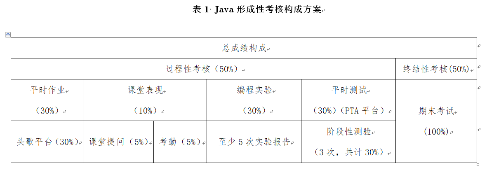
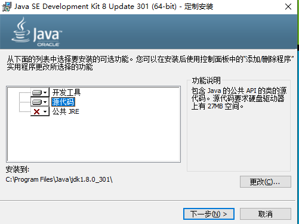
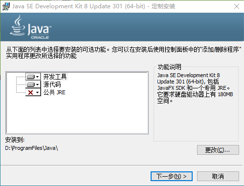

# 1、形成性评价方案



+ 第1次阶段性测验：第二章学习完之后进行
+ 第2次阶段性测验：第四章学习完之后进行
+ 第3次阶段性测验：期末考试之前进行

# 2、Java

+ sun公司开发，1995年，Oracle收购
+ 高级语言，编译型语言

## 2.1 三个技术平台

+ Java SE（Java standard edition）：标准版
+ Java EE（Java enterprise edition）：企业版
+ Java ME（Java micro edition）：微型版

+ Java的地位：运行与维护

## 2.2 Java特点

+ 简单：Java语言是一种相对简单的编程语言，能够通过最基本的方法完成指定的任务。
+ 面向对象：Java语言是一个纯粹的面向对象程序设计语言，它提供了类、接口和继承等原语。
+ 安全性：Java语言安全可靠。Java编译器在编译程序时，不显示存储安排决策，Java程序中的存储是在程序运行时由Java解释程序决定。
+ 跨平台性：Java通过JVM（虚拟机）以及字节码实现跨平台。

Java源代码--编译--.class字节码文件--任意安装了JDk的平台都能够运行

可移植性强

+ 支持多线程：Java语言支持多线程。多线程简单理解为程序中多个任务可以并发执行，多线程可以在很大程度上提高程序的执行效率。
+ 分布式：Java是分布式语言，既支持各种层次的网络连接，又可以通过Socket类支持可靠的流(stream)进行网络连接。

相对于单体架构来说，将单体架构比喻成大超市，将分布式架构比喻成商业街。

## 2.3 Java的发展史

# 3、JDK的下载和安装

+ JDK（Java Development Kit）

## 3.1 下载JDK

Oracle官网---products--Java--download Java now--Java archive--Java SE 8

## 3.2 安装JDk

+ 明确安装位置
+ 
+ 

+ 注意：1、明确安装位置。2、安装路径中不要包含中文字符
+ 如果不清楚安装到哪儿了，可以先卸载再明确位置进行安装即可

# 4、编写第一个Java程序

## 4.1 编写打印HelloWorld字符串的程序

```java
public class HelloWorld{
	public static void main(String[] args){
		System.out.println("Hello World");
	}
}
```

## 4.2 编译源代码

- 在Java文件所在的文件夹地址栏，中输入cmd，点击回车，进入相应的命令行窗口。（或者shift+右键打开命令行窗口---在命令行窗口）
- javac HelloWorld.java，来编译源代码，产生一个字节码文件。

## 4.3  运行字节码文件

+ java HelloWorld

