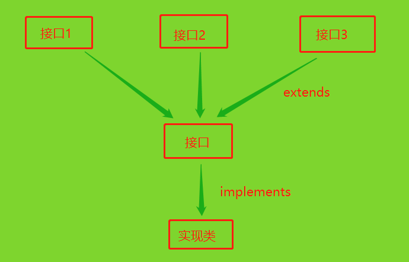
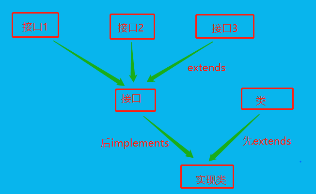

# 1 回顾

+ final：最终的
  + 修饰变量（全局常量：public static final）：全局常量不能改
  + 修饰类：被final修饰的类，不能有子类
  + 修饰方法：被final修饰的方法，不能重写
+ abstract：抽象的
  + 修饰类：抽象类（抽象类不能创建对象）
  + 修饰方法：抽象方法（没有方法体的方法）
  + 注意：
    + 有抽象方法的类一定是抽象类、抽象类不一定有抽象方法
    + 抽象方法不能用private修饰

# 2 抽象类实践

## 2.1 图形的面积与周长的计算

### 2.1.1 父类（Graph）

```java
public abstract class Graph {
	// 成员变量
	// 成员方法
	public abstract double getArea();
	public abstract double getZhouChang();
	// 构造方法
}
```

### 2.1.2 子类（Circle）

```java
public class Circle extends Graph{
	// 成员变量
	private double radius;
	private static final double PI = 3.1415926;
	// 构造方法
	public Circle(double radius) {
		super();
		this.radius = radius;
	}
	public Circle() {
		super();
	}
	// 成员方法
	public double getRadius() {return radius;	}
	public void setRadius(double radius) {this.radius = radius;	}
	
	@Override
	public double getArea() {
		// TODO Auto-generated method stub
		return PI*radius*radius;
	}
	@Override
	public double getZhouChang() {
		// TODO Auto-generated method stub
		return 2*PI*radius;
	}
}
```

### 2.1.3 测试类（Test）

```java
public class Test {
	
	public static void main(String[] args) {
		Graph g1 = new Circle(5.5);
		System.out.printf("该图形的面积%.2f,周长%.2f\n",
				g1.getArea(),g1.getZhouChang());
	}
}
// 该图形的面积95.03,周长34.56
```

## 2.2 打印图形

### 2.2.1 父类（Graph）

```java
public abstract class Graph {
	// 成员变量
	// 构造方法
	// 成员方法
	public abstract void print();
}
```

### 2.2.2 子类（Square）

```java
public class Square extends Graph{
	// 成员变量
	private int side;
	// 构造方法
	public Square() {
		super();
	}
	public Square(int side) {
		super();
		this.side = side;
	}
	// 成员方法
	public int getSide() {return side;	}
	public void setSide(int side) {this.side = side;	}
	
	@Override
	public void print() {
		for (int i = 0; i < side; i++) {
			for (int j = 0; j < side; j++) {
				System.out.print("*");
			}
			System.out.println();
		}
	}
}
```

### 2.2.3 测试类（Test）

```java
public class Test {
	public static void main(String[] args) {
		Graph g1 = new Square(5);
		g1.print();
	}
}
// *****
// *****
// *****
// *****
// *****
```

# 3 接口

+ 接口的作用：

  + 1、制定标准（协议）：在接口中，规定了做什么，但不管具体怎么做
  + 2、接口能够解决Java中类单继承的局限性，主要有以下3种方式：

  

  



+ 接口的应用场景：
  + 当一个类中，所有的方法都是抽象方法时，就可以将这个类定义为接口（接口是一个特殊的类）
  + 关键字：interface
  + 类实现接口的关键字：implements

## 3.1 实践

### 3.1.1 接口（Graph）

```java
public interface Graph {
	// 成员变量
	// 构造方法
	// 成员方法
	public abstract double getArea();
	public abstract double getZhouChang();
}
```

### 2.1.2 实现类（Circle）

```java
public class Circle implements Graph{
	// 成员变量
	private double radius;
	private static final double PI = 3.1415926; 
	// 构造方法
	public Circle(double radius) {
		super();
		this.radius = radius;
	}
	public Circle() {
		super();
	}
	// 成员方法
	public double getRadius() {return radius;	}
	public void setRadius(double radius) {this.radius = radius;}
	@Override
	public double getArea() {
		// TODO Auto-generated method stub
		return PI*radius*radius;
	}
	@Override
	public double getZhouChang() {
		// TODO Auto-generated method stub
		return 2*PI*radius;
	}
}
```

### 2.1.3 测试类

```java
public class Test {
	
	public static void main(String[] args) {
		Graph g1 = new Circle(5.5);
		System.out.printf("该图形的面积和周长分别为：%.2f,%.2f\n",
				g1.getArea(),g1.getZhouChang());
	}
}
//该图形的面积和周长分别为：95.03,34.56
```

## 3.2 接口的格式

- 在很多的Java程序中，经常看到编写接口中的方法时省略了public
  ，有很多读者认为它的访问权限是default，这实际上是错误的。不管写不写访问权限，接口中方法的访问权限永远是public。
- 接口是特殊的抽象类，本身不能直接实例化，接口中的抽象方法和默认方法只能通过接口实现类的实例对象进行调用。实现类通过implements关键字实现接口，并且实现类必须重写接口中所有的抽象方法。

```java
[public] interface 接口名 [extends 接口1,接口2...] {
	[public] [static] [final] 数据类型 常量名 = 常量;
	[public] [abstract] 返回值的数据类型 方法名(参数列表);
    
    // Java1.8以后出现的新特性，暂不做要求
	[public] static 返回值的数据类型 方法名(参数列表){}
	[public] default 返回值的数据类型 方法名(参数列表){}
}
```

## 3.3 接口实现多继承

+ 说明：extends和implements的本质：扩展子类的功能

### 3.3.1 方式1（多实现）

```java
修饰符 class 类名 implements 接口1,接口2,...{
    ...
}
```


+ Inter1

```java
public interface Inter1 {
	void eat();
}
```

+ Inter2

```java
public interface Inter2 {
	void sleep();
}

```

+ MyImpl实现类

```java
public class MyImpl implements Inter1,Inter2{

	@Override
	public void sleep() {
		System.out.println("正在就寝");
	}

	@Override
	public void eat() {
		System.out.println("正在就餐");	
	}

}
```

+ Test

```java
public class Test {
	public static void main(String[] args) {
		MyImpl m1 = new MyImpl();
		m1.eat();
		m1.sleep();
	}
}
//正在就餐
//正在就寝
```

### 3.3.2 方式2（多实现的变种）


- Inter1

```java
public interface Inter1 {
	void eat();
}
```

- Inter2

```java
public interface Inter2 {
	void sleep();
}

```

- Inter

```java
public interface Inter extends Inter1,Inter2{

}
```

- MyImpl实现类

```java
public class MyImpl implements Inter{

	@Override
	public void sleep() {
		System.out.println("正在就寝");
	}

	@Override
	public void eat() {
		System.out.println("正在就餐");	
	}

}
```

- Test

```java
public class Test {
	public static void main(String[] args) {
		MyImpl m1 = new MyImpl();
		m1.eat();
		m1.sleep();
	}
}
//正在就餐
//正在就寝
```

### 3.3.2 方式3（既继承又实现）

```java
修饰符 class 类名 extends 抽象类名 implements 接口1,接口2,... {
    ...
}
```


- Inter1

```java
public interface Inter1 {
	void eat();
}
```

- Inter2

```java
public interface Inter2 {
	void sleep();
}

```

- Inter

```java
public interface Inter extends Inter1,Inter2{

}
```

- Animal

```java
public class Animal {
	public void state(){
		System.out.println("我是一个可爱的小猫");
	}
}
```

- MyImpl实现类（先继承，再实现）

```java
public class MyImpl extends Animal implements Inter {

	@Override
	public void sleep() {
		System.out.println("正在就寝");
	}

	@Override
	public void eat() {
		System.out.println("正在就餐");	
	}
	
}
```

- Test

```java
public class Test {
	public static void main(String[] args) {
		MyImpl m1 = new MyImpl();
		m1.eat();
		m1.sleep();
		m1.state();
	}
}
//正在就餐
//正在就寝
//我是一个可爱的小猫
```