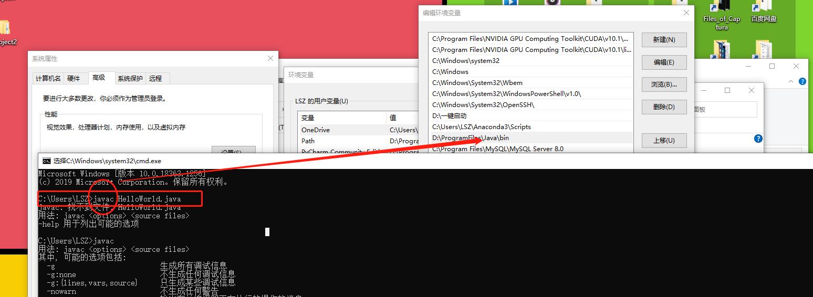
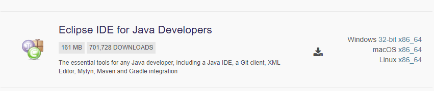
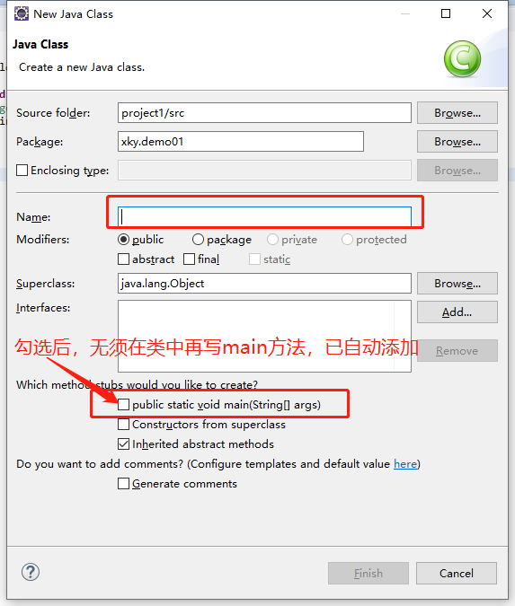

# 1、回顾内容

+ 编写、编译及执行第1个Java程序

# 2、打开指定目录下cmd的方式

## 2.1 第1种方式

+ windows键+R--运行--cmd--cd 指定目录地址

## 2.2 第2种方式

+ 在目标文件夹地址栏--输入cmd--回车即可

## 2.3 第3种方式

+ 在目标文件夹--shift键+鼠标右键---选择（在此处打开cmd终端）

# 3、配置环境变量

+ 为什么一定要在bin目录下编写、编译、执行java文件
+ 实践：利用cmd打开电脑中任意APP

## 3.1 原理

+ 当在命令行窗口运行一个命令时，操作系统首先会在当前目录下查找是否存在该命令对应的可执行文件，如果未找到，操作系统会继续在PATH环境变量中定义的路径下寻找这个文件，如果找到了，则成功调用，如果仍未找到，系统会报错。

  

## 3.2 步骤

+ 右键此电脑--属性---高级系统设置--环境变量---系统变量--Path---编辑---新建--将bin目录地址复制进来--确定即可

# 4、Java程序的设计风格

## 4.1 正确的缩进和空白

+ 缩进量：1个Tab键（推荐使用），或者4个空格
+ 空白：二元运算符左右各留一个空格

## 4.2 代码块的风格

+ 次行风格

```java
public class HelloWorld
{
	public static void main(String[] args)
	{
		System.out.println("Hello World");
	}
}
```

+ 行尾风格（推荐使用）

```java
public class HelloWorld{
	public static void main(String[] args){
		System.out.println("Hello World");
	}
}
```

# 5、常见错误

+ 遗漏右边的花括号

+ 遗漏引号

+ 大小写问题：String首字母大写，System首字母大写。

  切换中英文方法：shift

+ 遗漏语句终结符

+ 公共类名和文件名不一致的问题

# 6、eclipse的下载和启动

## 6.1 下载

+ eclipse官网---download packages--older versions---neon---随便选一个--Eclipse IDE for Java Developers--各取所需



## 6.2 启动

+ 解压缩后，就可以启动（前提：成功配置JDK中bin目录的环境变量）
+ workspace：用来存放你将要创建的项目
+ 介绍了窗口

# 7、使用eclipse编写第1个Java程序

## 7.1 创建项目

- 步骤：file--new--other--java project--name---finish
- 项目，可以理解为一个大文件夹

## 7.2 创建包

- 步骤：右键src文件夹--new--package---名称
- 名称：xky.demo01（xky文件是demo01文件夹的“父”文件夹）
- 包：其实就是文件夹

## 7.3 创建类

+ 步骤：右键（我们希望java类所在的文件夹）---new--class



## 7.4 编写程序

```java
public class HelloWorld{
	public static void main(String[] args){
		System.out.println("Hello World");
	}
}
```

## 7.5 运行程序

+ 右键编辑区域--run as ---- java application

# 8、包

- java文件中声明，自己属于哪个包
- 关键字：package xky.demo01;
- 有什么用？告诉java程序，这个class类属于哪个包，将来使用import调用这个类的时候，要使用包名。
- 声明包的语句：必须在程序的第一行。

# 9、如何重置eclipse界面

+ 步骤：window---perspective---reset perspective

# 10、第1章总结

- 本章主要介绍Java开发入门的一些知识。
- 首先介绍了Java语言、Java语言的相关特性和Java语言的发展史；
- 其次介绍了JDK的概念，并在Windows10系统中安装了JDK；
- 然后带领读者编写了 一个简单的Java程序，并讲解了环境变量的配置和Java程序的运行机制；
- 最后为读者介绍了常用的Java开发工具Eclipse，包括Eclipse的特点、下载、安装以及入门程序的编写和调试。
- 通过本章的学习，读者能够对Java语言有一个基础认识，为后面学习Java知识开启了大门。