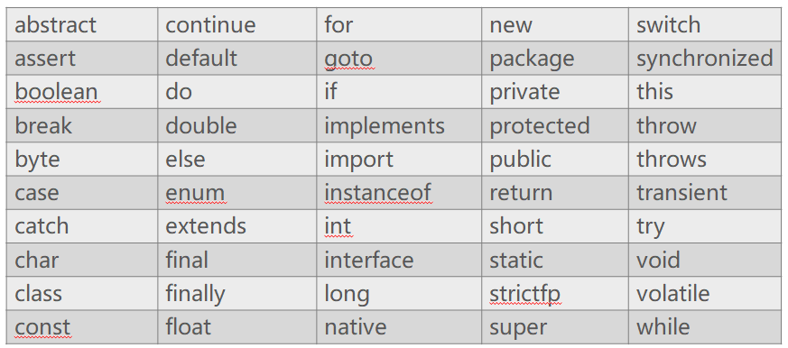

# 1、标识符

+ 所起的名字

## 1.1 规定

+ 有效字符：字母、数字、下画线（_）和美元符号（$）组成
+ 不能以数字开头
+ 不能和关键字冲突

## 1.2 约定俗称的命名准则

- 包名所有字母一律小写。例如：xky.demo01。
- 类名和接口名每个单词的首字母都大写。例如：ArrayList、Iterator、HelloWorld。
- 变量名和方法名的第一个单词首字母小写，从第二个单词开始每个单词首字母大写。例如：lineNumber、getLineNumber。
- 常量名所有字母都大写，单词之间用下画线连接。例如：DAY_OF_MONTH。

## 1.3 提示

+ 见名知意：应该尽量使用有意义的英文单词定义标识符，使得程序便于阅读。例如，使用userName定义用户名，password定义密码

+ 为了简洁起见，有的时候，我们也会以i、j、k、x、y、z等等来给变量起名字，例如：for(int i = 1; i <= 50; i++)

# 2 、注释

+ 作用：解释代码、标注作者信息，创建日期等等
+ 注释的内容是不回被执行的

## 2.1 单行注释

+ 标志：//

```java
public class HelloWorld {
	public static void main(String[] args) {
		//System.out.println("Hello World1");
		System.out.println("Hello World2");
		System.out.println("Hello World3");
	}
}
```

+ 快捷键：ctrl + /

## 2.2 多行注释

+ 标志：/*  被注释的内容  */

```java
public class HelloWorld {
	public static void main(String[] args) {
		/*System.out.println("Hello World1");
		System.out.println("Hello World2");*/
		System.out.println("Hello World3");
	}
}
```

+ 快捷键：ctrl + shift + /，取消多行注释：ctrl + shift + \

## 2.3 文档注释

+ 标志：/**  被注释的内容  */

```java
/**
 * @author LSZ
 */
package xky.demo01;

public class HelloWorld {
	public static void main(String[] args) {
		/*System.out.println("Hello World1");
		System.out.println("Hello World2");*/
		System.out.println("Hello World3");
	}
}
```

# 3 、关键字

+ Java官方占用的具有特定意义的名字



# 4、字面值

+ 基本数据类型：都有哪些表现形式

+ double radius = 0.5；
+ double radius = 5e-1；

## 4.1 整数

+ 二进制：binary，形式：0b或者0B开头。有效字符：0-1，例如：0b1111

```java
public class HelloWorld {
	public static void main(String[] args) {
		int a = 0b1111;
		System.out.println(a);
	}
}
// 15
```

+ 八进制：octal，形式：以0开头。有效字符：0-7，例如：071

```java
public class HelloWorld {
	public static void main(String[] args) {
		int a = 071;
		System.out.println(a);
	}
}
// 57
```

+ 十进制：注意：不能以0开头
+ 十六进制：hex，形式：0x或者0X。有效字符：0-9，A-F。例如：0xf

```java
public class HelloWorld {
	public static void main(String[] args) {
		int a = 0xF;
		System.out.println(a);
	}
}
// 15
```

