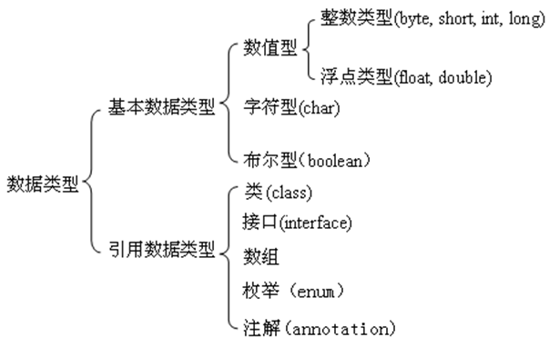
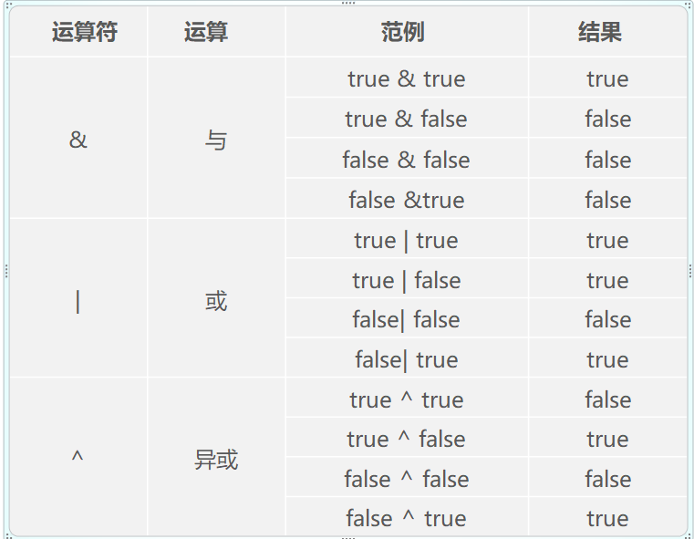
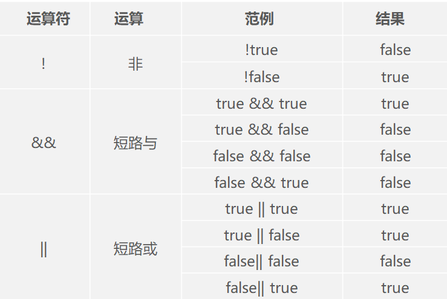

# 1、字面值

- 基本数据类型：都有哪些表现形式
- double radius = 0.5；
- double radius = 5e-1；

## 1.1 整数

- 二进制：binary，形式：0b或者0B开头。有效字符：0-1，例如：0b1111

```java
public class HelloWorld {
	public static void main(String[] args) {
		int a = 0b1111;
		System.out.println(a);
	}
}
// 15
```

- 八进制：octal，形式：以0开头。有效字符：0-7，例如：071

```java
public class HelloWorld {
	public static void main(String[] args) {
		int a = 071;
		System.out.println(a);
	}
}
// 57
```

- 十进制：注意：不能以0开头
- 十六进制：hex，形式：0x或者0X。有效字符：0-9，A-F。例如：0xf

```java
public class HelloWorld {
	public static void main(String[] args) {
		int a = 0xF;
		System.out.println(a);
	}
}
// 15
```

## 1.2 浮点数

+ 带小数点的数字：1.0、 1.23
+ 科学计数法：12.3 = 1.23e+1（e或者E：10的几次方）

```java
public class HelloWorld {
	public static void main(String[] args) {
		float a = 3.0f;    // 3.0f后面的f必须加上
		double b = 3.0;    // 浮点数默认类型为double
		
		// double计算的值更加精确
		System.out.println(1.0f / 3.0f); // 0.33333334
		System.out.println(1.0 / 3.0);   // 0.3333333333333333
	}
}
```

## 1.3 字符

+ 单引号内的内容

```java
public class HelloWorld {
	public static void main(String[] args) {
		char x = 'a';       // 任意单个字符，包括特殊字符
		char y = '\n';      // 转义字符
		char z = '\u0041';  // unicode码（uniform code）万国码
		System.out.println(x); 
		System.out.println(y);
		System.out.println(z);
	}
}
```

## 1.4 字符串

+ 由双引号包含的内容

```java
public class HelloWorld {
	public static void main(String[] args) {
		String str = "nihao";
		System.out.println(str);
	}
}
```

# 2 变量

+ 声明：double radius；
+ 初始化：radius = 5.5；

```java
public class HelloWorld {
	public static void main(String[] args) {
		// 定义变量两步走
		double radius; // 声明变量
		radius = 5.5;  // 初始化变量
		System.out.println(radius);
	}
}
```

## 2.1 变量的数据类型



## 2.2 整型的关键字

+ 声明整型变量时，只需int即可

| **类型** | **占用空间**    | **取值范围**     |
| -------- | --------------- | ---------------- |
| byte     | 8位（1个字节）  | -2^7  ～ 2^7-1   |
| short    | 16位（2个字节） | -2^15  ～ 2^15-1 |
| int      | 32位（4个字节） | -2^31  ～ 2^31-1 |
| long     | 64位（8个字节） | -2^63  ～ 2^63-1 |

## 2.3 浮点型的关键字

+ 声明浮点型变量时，只需double即可

| **类型名** | **占用空间**    | **取值范围**                                  |
| ---------- | --------------- | --------------------------------------------- |
| float      | 32位（4个字节） | 1.4E-45 ～ 3.4E+38,-3.4E+38  ～ -1.4E-45      |
| double     | 64位（8个字节） | 4.9E-324 ～ 1.7E+308, -1.7E+308  ～ -4.9E-324 |

## 2.4 字符的关键字

+ char

## 2.5 布尔数的关键字

+ boolean

```java
public class HelloWorld {
	public static void main(String[] args) {
		boolean x = true;
		boolean y = false;
		System.out.println(x);
		System.out.println(y);
	}
}
```

# 3 数据类型转换

## 3.1 自动数据类型转换

+ 右边的内容，能够完整的放到变量中去

```java
public class HelloWorld {
	public static void main(String[] args) {
		byte a = 127;
		int b = a;
		System.out.println(b);
	}
}
```

## 3.2 强制数据类型转换

+ 右边的内容，大于变量的存储空间
+ 语法：目标数据类型 b = (目标数据类型) a;

```java
public class HelloWorld {
	public static void main(String[] args) {
		int a = 0b1000101111;
		System.out.println(a);
		byte b = (byte)a;
		System.out.println(b);
	}
}
```

## 3.3 表达式类型自动提升

```java
public class HelloWorld {
	public static void main(String[] args) {
		byte a = 10;
		byte b = 20;
		byte c = (byte)(a + b);
		System.out.println(c);
	}
}
```

# 4 变量的作用域

+ 作用域：在其被声明的一对儿花括号之间

# 5 运算符

## 5.1 数值运算符

| **运算符** | **运算** | **范例** | **结果** |
| ---------- | -------- | -------- | -------- |
| +          | 正号     | +3       | 3        |
| -          | 负号     | b=4;-b   | -4       |
| +          | 加       | 5+5      | 10       |
| -          | 减       | 6-4      | 2        |
| *          | 乘       | 3*4      | 12       |
| /          | 除       | 5/5      | 1        |

| **运算符** | **运算**                 | **范例**   | **结果** |
| ---------- | ------------------------ | ---------- | -------- |
| %          | 取模（即算术中的求余数） | 7%5        | 2        |
| ++         | 自增（前）               | a=2;b=++a; | a=3;b=3; |
| ++         | 自增（后）               | a=2;b=a++; | a=3;b=2; |
| --         | 自减（前）               | a=2;b=--a; | a=1;b=1; |
| --         | 自减（后）               | a=2;b=a--; | a=1;b=2; |

```java
public class HelloWorld {
	public static void main(String[] args) {
		   // 
	       System.out.println(7.0 / 5);
	       System.out.println(7 / 5.0);
	       System.out.println(7 / 5);
	       
	       // 取模运算，结果跟随被除数的符号
	       System.out.println(7 % 5);
	       System.out.println(7 % -5);
	       System.out.println(-7 % 5);
	       System.out.println(-7 % -5);
	}
}
```

## 5.2 增强赋值运算符

```java
public class HelloWorld {
	public static void main(String[] args) {
		   int a  = 10;
		   int b = 0 ;
		   b += a; // b = b + a
		   System.out.println(b);
	}
}
```

| **运算符** | **运算** | **范例**      | **结果** |
| ---------- | -------- | ------------- | -------- |
| =          | 赋值     | a=3;b=2;      | a=3;b=2; |
| +=         | 加等于   | a=3;b=2;a+=b; | a=5;b=2; |
| -=         | 减等于   | a=3;b=2;a-=b; | a=1;b=2; |
| *=         | 乘等于   | a=3;b=2;a*=b; | a=6;b=2; |
| /=         | 除等于   | a=3;b=2;a/=b; | a=1;b=2; |
| %=         | 模等于   | a=3;b=2;a%=b; | a=1;b=2; |

## 5.3 比较运算符

| **运算符** | **运算**   | **范例** | **结果** |
| ---------- | ---------- | -------- | -------- |
| ==         | 等于       | 4 == 4   | false    |
| !=         | 不等于     | 4 != 3   | true     |
| <          | 小于       | 4 < 3    | false    |
| >          | 大于       | 4 > 3    | true     |
| <=         | 小于或等于 | 4 <= 3   | false    |
| >=         | 大于或等于 | 4 >= 3   | true     |

## 5.4 逻辑运算符





# 6 思路

+ double radius = 5.5；
+ 赋值符号右边的内容：字面值、表达式（字面值+运算符）、函数的返回值
+ 赋值符号左边的内容：各种（数据类型）的变量名
+ 赋值的本质：将右边的内容，存放到左边的容器中。