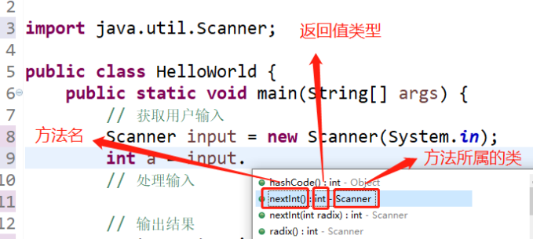

# 1 回顾内容

+ double radius = 5.5；

# 2 代码的IPO准则

+ 获取输入（input）
+ 处理输入（process）
+ 输出结果（output）

```java
public class HelloWorld {
	public static void main(String[] args) {
		// 获取用户输入
		double radius = 6.0;
		// 处理输入
		double area = 3.14 * radius * radius;
		// 输出结果
		System.out.println("圆面积为:" + area);
	}
}
```

# 3 输入的种类

+ 固定值输入
+ 获取用户输入
+ 音视频输入
+ 图片输入
+ 文件输入
+ 随机数输入

# 4 获取用户输入

+ 整型（int）、浮点型（double）、布尔数（boolean）、字符串（String）

## 4.1 获取整型输入

+ 获取完用户输入之后，要关闭input，节约资源
+ 获取多个输入的话，只需创建一个input



```java
import java.util.Scanner;

public class HelloWorld {
	public static void main(String[] args) {
		// 获取用户输入
		Scanner input = new Scanner(System.in);
		System.out.println("请输入整数：");
		int a = input.nextInt();
		System.out.println("请输入下一个整数：");
		int b = input.nextInt();
		input.close();  
		// 处理输入
		
		// 输出结果
		System.out.println("获取到的整数为：" + a + "," + b);
	}
}
```

## 4.2 获取浮点数

```java
import java.util.Scanner;

public class HelloWorld {
	public static void main(String[] args) {
		// 获取用户输入
		Scanner input = new Scanner(System.in);
		System.out.println("请输入整数：");
		double a = input.nextDouble();
		input.close();  
		// 处理输入

		// 输出结果
		System.out.println("获取到的整数为：" + a );
	}
}
```

## 4.3 获取布尔数

```java
import java.util.Scanner;

public class HelloWorld {
	public static void main(String[] args) {
		// 获取用户输入
		Scanner input = new Scanner(System.in);
		System.out.println("请输入整数：");
		boolean a = input.nextBoolean();
		input.close();  
		// 处理输入

		// 输出结果
		System.out.println("获取到的整数为：" + a );
	}
}
```

## 4.4 获取字符串

+ input不能获取字符

### 4.4.1 以空格为标记

```java
import java.util.Scanner;

public class HelloWorld {
	public static void main(String[] args) {
		// 获取用户输入
		Scanner input = new Scanner(System.in);
		System.out.println("请输入整数：");
		String a = input.next(); // 以空格为标记
		input.close();  
		// 处理输入

		// 输出结果
		System.out.println("获取到的整数为：" + a );
	}
}
```

### 4.4.2 以换行符为标记

```java
import java.util.Scanner;

public class HelloWorld {
	public static void main(String[] args) {
		// 获取用户输入
		Scanner input = new Scanner(System.in);
		System.out.println("请输入整数：");
		String a = input.nextLine(); // 以换行符为标记
		input.close();  
		// 处理输入

		// 输出结果
		System.out.println("获取到的整数为：" + a );
	}
}
```

## 4.5 获取字符

+ 通过字符串获取字符

```java
public class HelloWorld {
	public static void main(String[] args) {
		System.out.println("nihao".charAt(0));
	}
}
```

```java
import java.util.Scanner;

public class HelloWorld {
	public static void main(String[] args) {
		// 获取用户输入
		Scanner input = new Scanner(System.in);
		System.out.println("请输入整数：");
		String str1 = input.nextLine(); // 以换行符为标记
		input.close();  
		// 处理输入
		char x = str1.charAt(0);
		// 输出结果
		System.out.println("获取到的整数为：" + x );
	}
}
```

# 5 快捷键

+ alt + /   提供解决方案
+ 复制语句：ctrl + alt + ↓
+ 移动语句：alt + ↑ / ↓

# 6 选择语句

## 6.1 单向判断

+ if
+ 如果条件满足，则执行某种处理

```java
import java.util.Scanner;

public class HelloWorld {
	public static void main(String[] args) {
		Scanner input = new Scanner(System.in);
		System.out.println("咱们有多少钱？");
		int money = input.nextInt();
		input.close();
		
		if (money > 100){
			System.out.println("我们可以去吃火锅");
		} 
	}
}
```

## 6.2 双向判断

+ if else
+ 如果条件满足，则执行某种处理，否则，执行其他处理

```java
import java.util.Scanner;

public class HelloWorld {
	public static void main(String[] args) {
		Scanner input = new Scanner(System.in);
		System.out.println("咱们有多少钱？");
		int money = input.nextInt();
		input.close();
		
		if (money > 100){
			System.out.println("我们可以去吃火锅");
		}else{
			System.out.println("我们可以回家吃饭");
		} 
	}
}
```

## 6.3 多向判断

+ if  、 else if 、else
+ else可要可不要
+ 多选1
+ 多个条件，要严丝合缝

```java
import java.util.Scanner;

public class HelloWorld {
	public static void main(String[] args) {
		Scanner input = new Scanner(System.in);
		System.out.println("咱们有多少钱？");
		int money = input.nextInt();
		input.close();
		
		if (money > 100){
			System.out.println("我们可以去吃火锅");
		}else if (money > 80){
			System.out.println("我们可以去吃干锅");
		}else if (money > 50){
			System.out.println("我们可以去吃麻辣烫");
		}else if (money > 25){
			System.out.println("我们可以去吃拌面");
		}else{
			System.out.println("我们可以回家吃饭");
		} 
	}
}
```

## 6.4 三元运算符

+ 双向选择的简化表达形式
+ ？：
+ ？：是成对儿出现的
+ 三元运算符可以嵌套，但是不建议

```java
import java.util.Scanner;

public class HelloWorld {
	public static void main(String[] args) {
		Scanner input = new Scanner(System.in);
		System.out.println("咱们有多少钱？");
		int money = input.nextInt();
		input.close();
		
		/*if (money > 100){
			System.out.println("我们可以去吃火锅");
		}else{
			System.out.println("我们可以回家吃饭");
		}*/ 
		System.out.println(money > 100?"我们可以去吃火锅":"我们可以回家吃饭");
	}
}
```

## 6.5 switch语句

## 6.6 if嵌套

