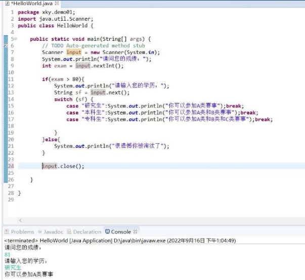
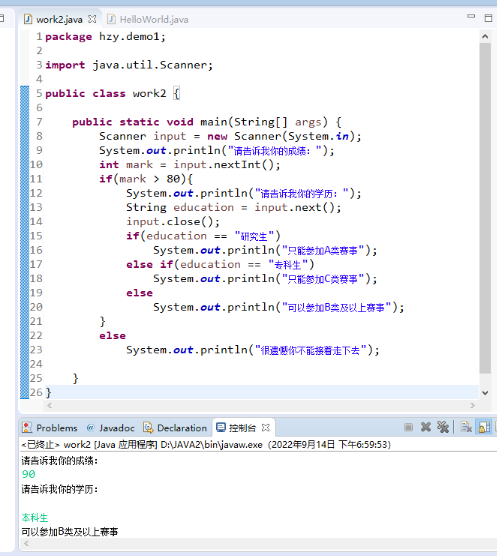
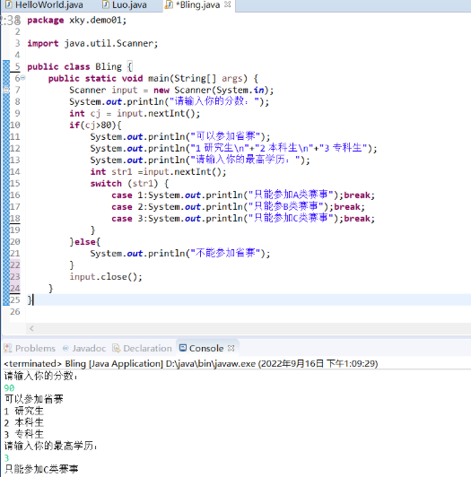

# 1 选择语句

## 1.1 单向判断

+ if
+ 如果条件满足，则执行某种处理

```java
import java.util.Scanner;

public class HelloWorld {
	public static void main(String[] args) {
		Scanner input = new Scanner(System.in);
		System.out.println("咱们有多少钱？");
		int money = input.nextInt();
		input.close();
		
		if (money > 100){
			System.out.println("我们可以去吃火锅");
		} 
	}
}
```

## 1.2 双向判断

+ if else
+ 如果条件满足，则执行某种处理，否则，执行其他处理

```java
import java.util.Scanner;

public class HelloWorld {
	public static void main(String[] args) {
		Scanner input = new Scanner(System.in);
		System.out.println("咱们有多少钱？");
		int money = input.nextInt();
		input.close();
		
		if (money > 100){
			System.out.println("我们可以去吃火锅");
		}else{
			System.out.println("我们可以回家吃饭");
		} 
	}
}
```

## 1.3 多向判断

+ if  、 else if 、else
+ else可要可不要
+ 多选1
+ 多个条件，要严丝合缝

```java
import java.util.Scanner;

public class HelloWorld {
	public static void main(String[] args) {
		Scanner input = new Scanner(System.in);
		System.out.println("咱们有多少钱？");
		int money = input.nextInt();
		input.close();
		
		if (money > 100){
			System.out.println("我们可以去吃火锅");
		}else if (money > 80){
			System.out.println("我们可以去吃干锅");
		}else if (money > 50){
			System.out.println("我们可以去吃麻辣烫");
		}else if (money > 25){
			System.out.println("我们可以去吃拌面");
		}else{
			System.out.println("我们可以回家吃饭");
		} 
	}
}
```

## 1.4 三元运算符

+ 双向选择的简化表达形式
+ ？：
+ ？：是成对儿出现的
+ 三元运算符可以嵌套，但是不建议

```java
import java.util.Scanner;

public class HelloWorld {
	public static void main(String[] args) {
		Scanner input = new Scanner(System.in);
		System.out.println("咱们有多少钱？");
		int money = input.nextInt();
		input.close();
		
		/*if (money > 100){
			System.out.println("我们可以去吃火锅");
		}else{
			System.out.println("我们可以回家吃饭");
		}*/ 
		System.out.println(money > 100?"我们可以去吃火锅":"我们可以回家吃饭");
	}
}
```

## 1.5 if嵌套

+ if中有if，if有三种：单向判断、双向判断、多向判断
+ 最为常用的嵌套：双向判断中，嵌套其他的if语句
+ 一般就两层嵌套，多了会降低代码的可读性

```java
import java.util.Scanner;

public class HelloWorld {
	public static void main(String[] args) {
		Scanner input = new Scanner(System.in);
		System.out.println("咱们有多少钱？");
		int money = input.nextInt();
		input.close();
		
		if(money > 0){
			if (money > 100){
				System.out.println("我们可以去吃火锅");
			}else if (money > 80){
				System.out.println("我们可以去吃干锅");
			}else if (money > 50){
				System.out.println("我们可以去吃麻辣烫");
			}else if (money > 25){
				System.out.println("我们可以去吃拌面");
			}else{
				System.out.println("我们可以回家吃饭");
			} 			
		}else{
			System.out.println("你输入有误");
		}
	}
}
```

## 1.6 switch语句 

+ 多向判断的简化表达形式。
+ 关键字：switch、case
+ 多选1
+ switch倾向于离散点判断
+ switch语句的表达式的值和每个case的值去匹配，如果找到了匹配的值，则执行相应case后的代码块；如果找不到匹配的值，则执行default后的代码块。
+ switch运行结束的标志，1、遇到break；2、switch语句运行到最后
+ 表达式的值：整数、字符串、字符
+ break可要可不要
+ default可要可不要

```java
import java.util.Scanner;

public class HelloWorld {
	public static void main(String[] args) {
		Scanner input = new Scanner(System.in);
		System.out.println("请输入1-7之间的数字：");
		int week = input.nextInt();
		input.close();
		
		switch (week) {
			case 1:System.out.println("今天是星期一");break;
			case 2:System.out.println("今天是星期二");break;
			case 3:System.out.println("今天是星期三");break;
			case 4:System.out.println("今天是星期四");break;
			case 5:System.out.println("今天是星期五");break;
			case 6:System.out.println("今天是星期六");break;
			case 7:System.out.println("今天是星期天");break;
			default: System.out.println("输入有误");break;
		}		
	}
}
```

+ 如果多个case后的执行语句一样，那么执行语句只需书写一次。

```java
import java.util.Scanner;

public class HelloWorld {
	public static void main(String[] args) {
		Scanner input = new Scanner(System.in);
		System.out.println("请输入1-7之间的数字：");
		int week = input.nextInt();
		input.close();
		
		switch (week) {
			case 1:
			case 2:
			case 3:
			case 4:
			case 5:System.out.println("今天是工作日");break;
			case 6:
			case 7:System.out.println("今天是周末");break;
			default: System.out.println("输入有误");break;
		}		
	}
}
```

# 2 练习

## 2.1 if嵌套的练习

### 2.1.1 校赛省赛

+ 如果校赛成绩大于80分，可以参加省赛，否则不可以。可以参加省赛的同学，如果是研究生，则只能参加A类赛事。如果是本科生，则能参加B类及A类赛事。如果是专科生，则能参加C类B类A类赛事。







## 2.2 switch的练习

### 2.2.1 n天以后星期几

```java
import java.util.Scanner;

public class HelloWorld {
	public static void main(String[] args) {
		Scanner input = new Scanner(System.in);
		System.out.println("n天以后星期几：");
		int n = input.nextInt();
		input.close();
		
		switch ((5+n)%7) {
			case 0:System.out.println(n + "天以后是星期天");break;
			case 1:System.out.println(n + "天以后是星期一");break;
			case 2:System.out.println(n + "天以后是星期二");break;
			case 3:System.out.println(n + "天以后是星期三");break;
			case 4:System.out.println(n + "天以后是星期四");break;
			case 5:System.out.println(n + "天以后是星期五");break;
			case 6:System.out.println(n + "天以后是星期六");break;
		}
	}
}
```

### 2.2.2 2017年的生肖

+ 输入是年份、输出为当年的生肖

```java
import java.util.Scanner;

public class HelloWorld {
	public static void main(String[] args) {
		Scanner input = new Scanner(System.in);
		System.out.println("请输入要查询的年份：");
		int year = input.nextInt();
		input.close();
		
		switch (year % 12) {
			case 0:System.out.println(year + "年是猴年");break;
			case 1:System.out.println(year + "年是鸡年");break;
			case 2:System.out.println(year + "年是狗年");break;
			case 3:System.out.println(year + "年是猪年");break;
			case 4:System.out.println(year + "年是鼠年");break;
			case 5:System.out.println(year + "年是牛年");break;
			case 6:System.out.println(year + "年是虎年");break;
			case 7:System.out.println(year + "年是兔年");break;
			case 8:System.out.println(year + "年是龙年");break;
			case 9:System.out.println(year + "年是蛇年");break;
			case 10:System.out.println(year + "年是马年");break;
			case 11:System.out.println(year + "年是羊年");break;
		}
	}
}
```

### 2.2.3 成绩等级的划分(下节课投稿)

+ 请使用switch语句，对同学们的成绩做一个等级划分。90-100为A级，80-90为B级，70-80为C级，60-70为D级，60分以下为E级

### 2.2.4 输出某一天对应当年的第几天（选做）

+ 输入年、月、日，输出这一天是当年的第几天。（注意：判断这年是否是闰年，闰年的2月为29天，非闰年为28天）

